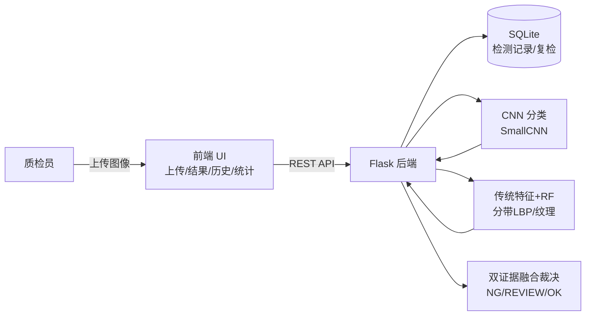

# 需求规格说明书 —— 工业产品表面缺陷智能检测系统

> 课程：制造智能技术课程设计 ｜ 版本：v1.0 ｜ 日期：2026-09-03

## 1. 引言

### 1.1 目的
面向电气换向器塑料表面（KolektorSDD）的制造质量检测场景，构建一套 **B/S 架构的
工业产品表面缺陷智能检测系统**，用 2 类 AI 技术手段（深度学习 CNN、传统特征+机器学习）
对工件表面图像自动判别「正常 / 缺陷 / 疑似待复检」，并提供检测历史与质检统计，
支撑质量检验环节的自动化与可追溯。

### 1.2 范围
- 输入端：单张工件表面灰度/彩色图像（jpg/png/bmp）的上传与在线检测；
- 处理端：图像预处理 → 双模型并行推理（CNN 主判定 + 传统特征 RF 对照）→ 双证据融合裁决；
- 输出端：检测判定（NG/REVIEW/OK）、双路概率、缺陷位置（条带）、人工复检闭环、历史查询、统计图表。

### 1.3 名词与定义
| 术语 | 说明 |
|---|---|
| KolektorSDD | 换向器表面缺陷公开数据集（399 图，52 缺陷，CC BY-NC-SA 4.0） |
| NG | 两路模型同判缺陷 → 判不合格 |
| REVIEW | 仅一路判缺陷（分歧）→ 转人工复检 |
| OK | 两路均判正常 → 放行 |
| 缺陷带 | 传统 RF 将图像沿高切 8 条，输出缺陷概率最高的条带序号 |

### 1.4 参考资料
1. 《制造智能技术课程设计任务书》（本课程）
2. KolektorSDD 数据集说明（data/raw/dataset_info）
3. 《制造智能技术基础》张智海等，清华大学出版社（机器学习/深度学习/模式识别章节）

## 2. 总体描述

### 2.1 产品定位与角色
- 使用者：制造车间质检员/工程师（作者确认：是否需登录/多角色？默认单用户演示）。
- 业务流程：**上传工件图 → 自动检测 → 展示判定 → （必要时）人工复检 → 留档统计**。

### 2.2 运行环境
| 项 | 约定 |
|---|---|
| 后端 | Python 3.10 + Flask + SQLite |
| 算法 | PyTorch（CNN，GPU/CPU 自适应）+ scikit-learn/OpenCV（传统特征+RF） |
| 前端 | 原生 HTML/CSS/JS + ECharts（本地库，可离线演示） |
| 演示机 | Windows 单机，conda 环境 `cv_tutorial` |

### 2.3 系统架构

### 2.4 技术方向覆盖映射
| 课程技术方向 | 系统落点 | 实际作用 |
|---|---|---|
| 深度学习（图像分类） | `ml/model.py`、`scripts/train.py` | 主判定路：SmallCNN(24万参数) 端到端特征学习，高灵敏检出缺陷 |
| 模式识别 / 特征工程 | `ml/features.py`、`scripts/train_ml.py` | 对照路：分带 LBP/梯度/统计特征 + RF，高特异、低误报 |
| 数据预处理与增强 | `scripts/preprocess.py`、`ml/transforms.py`、`ml/dataset.py` | letterbox 保形缩放、归一化、按缺陷分层划分、在线增强、双证据融合输入准备 |
| 质检业务/数据库 | `backend/` | 双证据裁决、人工复检闭环、SQLite 历史与统计 |

## 3. 数据资源构建
- 来源：KolektorSDD 官网，压缩包含 `kos01..kos50`，每工件若干 `PartN.jpg` + `PartN_label.bmp`。
- 规模：399 张工件图（宽 500 × 高约 1249~1284），其中 52 张含缺陷、347 张正常（约 1:6.7 不平衡）。
- 预处理（`scripts/preprocess.py --img-size 384`）：
  - 仅保留真实工件图（排除掩码被误当图像的早期 BUG，见过程档案）；
  - 等比缩放使长边=384 并居中填充 → 384×384（保持几何比例不失真）；
  - 由掩码提取缺陷框（YOLO 归一化坐标）→ `annotations.csv`；
  - 按缺陷标签**分层划分** 70/15/15（seed=42）→ train/val/test = 279/60/60。
- 产物：`data/processed/{images,masks,annotations.csv,dataset_meta.json}`、`data/splits/*.txt`。
  （原始图与加工图较大，不入 git，可由 preprocess 再生成。）

## 4. 功能需求

> 编号规则：FR-x。每条含 描述 / 输入 / 输出 / 验收。

### FR-1 图像上传
- 描述：支持点击选择或拖拽上传工件表面图片，本地实时预览。
- 输入：jpg/png/bmp。
- 输出：上传图预览；非法格式给出错误提示。
- 验收：选择图片后出现预览且触发自动检测。

### FR-2 自动检测（可调阈值）
- 描述：后端对上传图执行 预处理→双模型推理→融合裁决；阈值可由前端调整（0.1~0.9）。
- 判定规则：
  - `p_cnn ≥ thr 且 p_ml ≥ thr` → **NG**；
  - 仅一路 ≥ thr → **REVIEW**；
  - 均 < thr → **OK**。
- 输出：JSON（id/filename/verdict/p_cnn/p_ml/ml_band/threshold/image_url）。
- 验收：缺陷图样例应判 NG（双证据）；正常图判 OK。

### FR-3 结果展示
- 描述：结果面板展示判定徽章、双路概率条、RF 缺陷带位置、融合规则说明。
- 验收：概率∈[0,1]；条带提示为 1..8。

### FR-4 检测历史
- 描述：按时间倒序分页展示检测记录（ID/时间/文件名/判定/双概率/缺陷带/复检状态），可查看图像。
- 接口：`GET /api/records?limit=&offset=`。
- 验收：新检测即时出现在历史首行。

### FR-5 人工复检闭环
- 描述：对 NG/REVIEW 记录，复检员可标记「放行(pass)」或「确认缺陷(fail)」；OK 记录不可复检。
- 接口：`POST /api/records/<id>/review`，body `{"result":"pass|fail"}`。
- 验收：复检后历史状态与统计同步更新，按钮不再可重复操作。

### FR-6 统计报表
- 描述：顶部 KPI（总数/正常/缺陷/待复检/缺陷率/复检放行/复检确认）+ 判定分布饼图 + 近 50 次趋势图。
- 接口：`GET /api/stats`。
- 验收：每次检测/复检后统计自动刷新。

### FR-7 健康检查
- 描述：前端启动时检测后端连通性并显示状态徽标。
- 接口：`GET /api/health`。

## 5. 非功能需求
| 类别 | 指标 |
|---|---|
| 性能 | 演示机（CPU/GPU 自适应）单次检测 < 3 s（作者确认：演示时实测记录时间） |
| 准确性 | 见 §8 验收指标（测试集 60 张/8 缺陷基线） |
| 可用性 | 全中文界面；操作 ≤ 3 步走通检测流程 |
| 可靠性 | 上传非法文件返回明确错误不崩溃；图片/DB 崩溃不阻断主流程 |
| 可维护性 | 算法在 `ml/`、业务在 `backend/`、前端在 `frontend/` 分层；`scripts/` 可复现训练 |
| 兼容性 | 后端 Python 3.10；前端现代浏览器 |
| 合规 | 数据集 CC BY-NC-SA 4.0（非商业），仅用于课程 |

## 6. 外部接口（REST API 摘要）
| 方法/路径 | 说明 | 关键字段 |
|---|---|---|
| GET /api/health | 存活 | status |
| POST /api/predict | multipart 上传检测 | image、threshold → id/verdict/p_cnn/p_ml/ml_band |
| GET /api/records | 历史分页 | limit/offset → records[] |
| POST /api/records/{id}/review | 复检回填 | result: pass/fail |
| GET /api/stats | 质检统计 | total/ok/ng/review/defect_rate/review_pass/review_fail/recent |
| GET /api/image/{id} | 取历史图 | 图片字节 |

## 7. 约束与假设
- 演示为单机 B/S；不要求并发与鉴权（可后续扩展）。
- 缺陷极小且类不平衡：以「宁多检、不漏放」为业务取向，分歧交由人工复检。
- 传统特征路在微小缺陷上召回有限，但与 CNN 互补降低误报——这是**有意的架构取舍**而非缺陷。

## 8. 验收标准
1. `python -m pytest tests -q` 全部通过（14 项：数据/几何/特征/推理/API 流程/复检）。
2. B/S 闭环可演示：上传缺陷图→NG、正常图→OK、复检→统计联动（已在浏览器实测）。
3. 测试集参考指标（baseline，60 张 / 8 缺陷）：
   - CNN：Balanced Acc 0.784、Recall(缺陷) 0.875、AUC 0.860；
   - 分带 RF：Precision 1.000、AUC 0.793（作者确认：可在报告如实引用并说明其局限）。
4. 覆盖 ≥3 个课程技术方向且均有实际作用（§2.4）。
