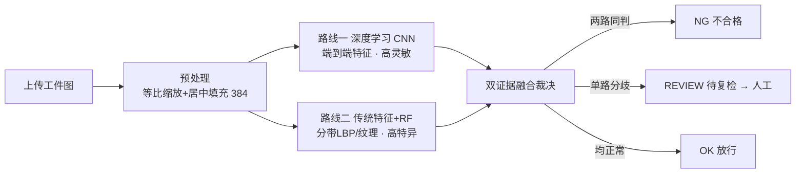

# 基于机器学习的工业产品质量智能检测系统
## —— 设计报告

- 课程：制造智能技术课程设计
- 题目：基于机器学习的工业产品质量智能检测系统
- 姓名 谢兰宇/ 学号 19/ 班级：智造24-2
- 开发方法：Vibe Coding（AI 编程辅助 + 人工审查）
- 日期：9.3


---

## 摘要

面向电气换向器塑料表面的质量检测场景，本文设计并实现了一个**B/S 架构的工业产品表面
缺陷智能检测系统**。系统以公开工业数据集 KolektorSDD（399 张图像，52 缺陷/347 正常，
缺陷为极细暗条、类不平衡严重）为对象，完整覆盖"数据预处理—算法推理—业务裁决—
数据库留档—前端交互"的质检闭环。算法层采用**双证据融合**：自研轻量卷积神经网络
(SmallCNN) 高灵敏检出，传统特征+随机森林（分带 LBP/纹理，高特异低误报）作为对照路，
两路一致判 NG、分歧进 REVIEW 转人工复检、两路正常放行 OK。系统前端提供上传/结果/
统计/历史一体化看板，后端用 Flask + SQLite 承载业务，建立了 15 项 pytest 自动化测试。
测试集上：缺陷拦截率 0.875（8 张漏 1），合格品误判为废品数为 0。本项目体现了
机器学习/深度学习、模式识别与特征工程、数据预处理与增强等多技术方向的综合运用。

**关键词**：表面缺陷检测；卷积神经网络；传统特征；随机森林；双证据融合；B/S；KolektorSDD

---

## 1 背景调研与研究意义

### 1.1 行业背景
制造质量检验是生产环节的关键。传统人工目检依赖经验、易疲劳、漏检率不稳定，且难以
沉淀数据形成闭环。随着机器视觉与机器学习发展，"以图像代替人眼、以模型代替经验"的
智能质检成为趋势，其价值在于：客观可复现、可实时、可追溯。

### 1.2 任务难点
本课题选用公开的换向器表面缺陷数据集 KolektorSDD，其特性集中体现了质检任务的难点：
1. **缺陷极其细微**：缺陷为像素级暗色细长条，在整图中占比极小；
2. **类不平衡严重**：399 张中仅 52 张含缺陷（约 1:6.7）；
3. **表面纹理复杂**：无缺陷表面本身颗粒感强，易干扰判别；
4. **需要完整业务闭环**：不能只做一个分类器，还要能演示"检测—裁决—人工复检—留档"。

### 1.3 研究目标
在单台笔记本（GPU/CPU 自适应）上，实现一套可现场演示的 B/S 质检系统：能对上传工件图
自动给出三态判定，覆盖 ≥3 个课程技术方向，具备数据库与自动化测试，达到工程可交付状态。

---

## 2 方案设计

### 2.1 总体技术路线
图像输入后统一预处理，再**并行送入两条 AI 路线**，最后做业务裁决：



### 2.2 为什么用"双证据融合"
单一模型在微小缺陷 + 极端不平衡下难以同时压低**漏检**与**误报**：
- 若提高灵敏度 → 合格品被误判为废品（成本高）；
- 若提高特异性 → 缺陷被漏放（质量事故）。
实测表明两条路线互补（见 §5.3）：CNN 灵敏、传统 RF 特异。因此采用三态裁决，把
"不确定"显式交给人工复检，业务上做到"宁多检、不漏放、机器不武断、人工把关"。

### 2.3 技术选型
| 层级 | 选型 | 理由 |
|---|---|---|
| 前端 | HTML/CSS/JS + ECharts（本地库） | 无需构建工具，单机演示/离线稳定 |
| 后端 | Python 3.10 + Flask | 轻量、易演示 |
| 算法 | PyTorch(CNN) + scikit-learn/OpenCV(传统特征+RF) | 覆盖深度学习与传统机器学习两方向 |
| 数据库 | SQLite | 嵌入式、零配置，随项目交付 |
| 测试 | pytest | 自动化回归，满足课程验收 |

### 2.4 技术方向覆盖映射
| 技术方向 | 系统落点 | 实际作用 |
|---|---|---|
| 深度学习 / CNN 图像分类 | `ml/model.py`、`scripts/train.py` | 主判定路（高灵敏检出） |
| 模式识别 / 特征工程 | `ml/features.py`、`scripts/train_ml.py` | 分带 LBP/纹理特征 + RF（高特异）与 CNN 双证据融合 |
| 数据预处理与增强 | `scripts/preprocess.py`、`ml/dataset.py` | letterbox 保形、归一化、分层划分、在线增强 |
| 质检业务 / 数据库 | `backend/` | 双证据裁决、人工复检闭环、SQLite 历史统计 |

### 2.5 系统架构
仓库按职责分层：`data/`(数据) · `ml/`(算法包) · `scripts/`(训练评估) ·
`backend/`(业务) · `frontend/`(界面) · `tests/`(自动化测试) · `docs/ process/`(文档档案)。

---

## 3 数据资源构建

### 3.1 数据集介绍
- 来源：KolektorSDD（http://www.vicos.si/resources/kolektorsdd/），许可 CC BY-NC-SA 4.0；
- 内容：电气换向器塑料表面灰度图 399 张（宽 500 × 高约 1249~1284），**52 张缺陷 / 347 张正常**；
- 标注：每张图对应一张二值掩码（`*_label.bmp`，白色为缺陷），缺陷呈细长暗条。

### 3.2 预处理设计（几何与划分）
实现于 `scripts/preprocess.py`，要点如下（这也是"数据预处理与增强"技术方向的落地）：
1. **只保留真实工件图**：显式排除把掩码文件当图像的早期 BUG（见 §6.3 纠错案例）；
2. **等比缩放 + 居中填充到 384×384**：原图宽 500、高 ~1250 的细长图若直接 resize 成
   正方形会把缺陷纵向压缩约 2.5 倍而几何失真；改为"长边缩放到 384 + 四周补 0"，**保持纵横比**；
3. **由掩码提取缺陷框**（YOLO 归一化坐标）写入 `annotations.csv`，供后续检测/可视化使用；
4. **按缺陷标签分层划分**（70/15/15，seed=42，train/val/test = 279/60/60）：因缺陷仅 13%，
   随机划分可能使验证/测试缺缺陷样本，分层抽样保证三集合缺陷比例均衡。

### 3.3 数据统计
| 集合 | 张数 | 说明 |
|---|---|---|
| train | 279 | 训练 |
| val | 60 | 选优/监控 |
| test | 60（缺陷 8） | 最终评估，未被训练触碰 |
| 合计 | 399 | 52 缺陷 / 347 正常 |

> 数据审计工具 `scripts/audit.py` 可对产物做一致性校验（数量/命名/污染检查）。

---

## 4 算法模块实现

### 4.1 路线一：深度学习 CNN（`ml/model.py`、`scripts/train.py`）
- **结构**：SmallCNN（约 24.1 万参数）——4 组 `Conv3×3(stride2)+BatchNorm+ReLU` 下采样，
  尾部 `AdaptiveAvgPool + Dropout + 线性层(2)`。全卷积 + 全局平均池化使网络对输入分辨率
  不敏感，后端可换分辨率推理；CPU 也可运行。
- **训练策略**：
  - 输入 1×384×384 灰度，归一化 `(x/255−0.5)/0.5`（训练/推理一致）；
  - **类不平衡**：`CrossEntropyLoss` 按类别频率反比加权（缺陷类权重约 3.84）；
  - **数据增强**：仅随机水平翻转。这是**实验结论**而非偷懒——在仅 279 张训练图时，
    更强的增强（平移/亮度抖动）实测使验证 BAcc 从 0.75 降到 0.5（欠拟合），故默认轻增强；
  - 优化器 Adam + `ReduceLROnPlateau`，按验证集**平衡准确率**保存最优权重。

### 4.2 路线二：传统特征 + 随机森林（`ml/features.py`、`scripts/train_ml.py`）
为体现"模式识别/特征工程"方向并形成对照，设计手工特征 + 机器学习基线：
- **特征构成（312 维）**：
  1. 全局灰度统计（均值/方差/偏度/峰度，4 维）——整体明暗与一致性；
  2. 4×4 分块均值/方差（32 维）——捕捉缺陷所在局部灰度突变；
  3. **LBP(r=1,8邻域) 全局直方图（256 维）**——刻画表面纹理规律，正常件纹理均匀，
     缺陷会破坏局部纹理；
  4. Sobel 梯度方向直方图(18) + 平均幅值(1) ——缺陷边缘方向；
  5. Canny 边缘密度(1)。
- **分带思想**：整图特征在"微缺陷 vs 颗粒纹理"上难以判别（试验见 §6.3）；于是把 384 图沿
  高度切成 **8 条横向带**，逐带提特征，随机森林对"带是否含缺陷"判别；图像级 = 各带缺陷
  概率最大值，同时天然给出**缺陷所在条带（定位）**。

### 4.3 双证据融合裁决（`backend/service.py::decide_verdict`）
```
两路缺陷概率均 ≥ 阈值  → NG（不合格）
仅一路 ≥ 阈值          → REVIEW（疑似，转人工复检）
两路均 < 阈值          → OK（放行）
```
阈值由前端可调（默认 0.5）。`ml_band` 给出传统路定位的条带，供结果展示。

---

## 5 系统实现

### 5.1 后端服务（`backend/`）
- `app.py`：Flask 应用与 REST API（health / predict / records / review / stats / image / reset）；
- `service.py`：模型惰性加载（后台预热）+ `predict_image`（letterbox→CNN→分带RF）+ 裁决；
- `db.py`：SQLite 访问层（records 表、复检回填、统计聚合、清空重置）。

主要接口：
| 方法/路径 | 说明 |
|---|---|
| POST /api/predict | multipart 上传图 + 阈值 → id/verdict/p_cnn/p_ml/ml_band/latency_ms |
| GET /api/records | 检测历史分页 |
| POST /api/records/&lt;id&gt;/review | 人工复检回填 pass/fail |
| GET /api/stats | KPI/缺陷率/复检分布/近50次 |
| GET /api/image/&lt;id&gt; | 历史图像副本 |
| POST /api/records/reset | 清空历史（演示/录视频清零，ID 从 #1 起） |

### 5.2 前端界面（`frontend/`）
原生 HTML/CSS/JS + 本地 ECharts，四区看板：
① 上传（点击/拖拽 + 预览）→ ② 结果（三态徽章、双路概率条、缺陷带、推理耗时、复检按钮）
→ ③ 统计（KPI + 判定饼图 + 趋势条带，趋势横轴=真实检测 ID 与历史对应）
→ ④ 历史（明细表 + 行内复检/看图）+「清空历史」。
前端通过 `fetch` 调后端，检测/复检后统计与历史自动联动刷新。

### 5.3 数据库设计（`backend/db.py`）
`records` 表字段：id(自增) / filename / saved_image / p_cnn / p_ml / ml_band / verdict /
review_result / created_at；索引 created_at。支持清空重置自增。

---

## 6 测试与集成调试

### 6.1 自动化测试（15 项 pytest 全部通过）
覆盖：数据划分/命名干净性、letterbox 几何、归一化、特征维度、分带特征形状、CNN 推理
输出范围、三态裁决规则、API 全流程（健康/上传/历史/统计/复检/异常/清空重置）。

### 6.2 测试集评估（test 60 张 / 缺陷 8 张）
**CNN 路线**：Balanced Acc ≈0.78、缺陷 Recall=0.875（漏检 1）、Precision≈0.30、AUC≈0.86，
混淆矩阵 `[[36,16],[1,7]]`。
**传统分带 RF 路线**：Precision=1.00、Recall=0.125、AUC≈0.79——高特异、低灵敏，与 CNN 互补。
**融合（业务口径，`scripts/eval_fusion.py`）**：

| 真实类别 | 系统裁决 | 结论 |
|---|---|---|
| 缺陷 8 | NG 1 · REVIEW 6 · 漏放 1 | **拦截率 0.875** |
| 正常 52 | OK 36 · 误 REVIEW 16 · **误 NG 0** | 无合格品被直接判废 |

> 说明：缺陷极小 + 测试集仅 8 张，指标方差大，本系统定位为"可演示、可解释、业务完整"
> 的课程 demo；CNN 仍显著优于传统方法，是"特征学习 vs 手工特征"的实证对照。

### 6.3 集成调试中的关键问题与纠错（亦见 AI 使用披露）
1. **数据污染**：早期预处理把掩码文件当图像入库，产物翻倍 → 审计发现并修复；
2. **掩码重名覆盖**：掩码保存丢 `kosXX` 前缀导致被覆盖 → 命名与图像对齐；
3. **过度增强反噬**：'full' 增强致欠拟合 → A/B 实验回归"仅翻转"；
4. **传统路线探索**：整图特征 RF、纯分割在微缺陷上失效 → 改"分带"；仍召回低但与 CNN 互补
   而转作融合证据（Precision=1 高特异）——**有意的架构取舍**；
5. **推理与训练域一致性**：`to_tensor` 需补 batch 维；JPEG 二次压缩使分带 RF 对 raw 域敏感，
   演示包统一用同域 processed 图（见 `scripts/prepare_demo.py` 头注释）；
6. 工程细节：`.gitignore` `_*.py` 误伤 `__init__.py`；趋势图横轴曾用相对序号 → 改真实检测 ID。

---

## 7 AI 使用披露（Vibe Coding 记录）

### 7.1 使用工具
- AI 编程助手 + Harness（按实际填写：如 DeepSeek/VS Code Copilot 等），全程辅助编码、排错、文档；
- 版本控制 git（小步提交，提交历史见仓库）。

### 7.2 关键 Prompt 策略
1. 任务拆解 + 明确验收标准（"跑通 pipeline / pytest 通过 / 浏览器走通"）；
2. 上下文工程：让 AI 先读真实代码与数据再改，避免凭假设写代码；
3. 规格驱动：先有需求说明，再分阶段实现与逐步验收；
4. 自动化测试 + 人工审查：每个关键逻辑补测试，产物用审计脚本交叉验证；
5. 调试接管：异常时缩小改动、最小复现，必要时回滚/重跑。

### 7.3 AI 出错案例与纠正（如实披露，报告/答辩重点）
见 §6.3 列表（数据污染、掩码覆盖、过度增强、域不一致等）：每例都经历了
"现象 → 定位根因 → 人工审查 → 修复 → 验证"的完整过程。说明 AI 能加速但**不能替代**
工程判断与人工核验；报告中相关段落均由作者本人复核。

---

## 8 总结与展望

### 8.1 成果
- 完整 B/S 质检系统：前端看板 + Flask/SQLite + 双模型算法 + 15 项测试，浏览器端到端可演示；
- 三态融合裁决把"不确定"交给人工复检，合格品误判废品为 0、缺陷拦截率 0.875；
- 全程 git 小步提交 + 过程档案 + 需求/测试/演示文档齐备。

### 8.2 不足
- 缺陷极细小且测试样本少，指标波动大；CNN 仍有限；
- 传统特征路对 JPEG 纹理域敏感（见 §6.3-5）；
- 单机演示、无多用户/权限与并发。

### 8.3 展望
- 引入无监督异常检测（正常件建模）与像素级分割以提升极端微小缺陷检出；
- patch/多尺度推理、JPEG 域增强，缩小训练/部署域差异；
- 接入产线实时流、多工位并行、可视化大屏与告警；完善权限与审计。

---
